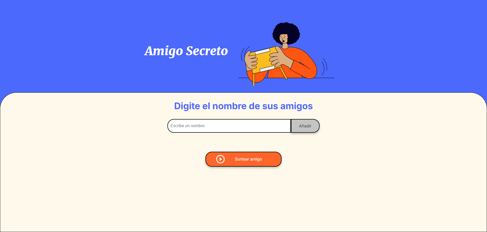
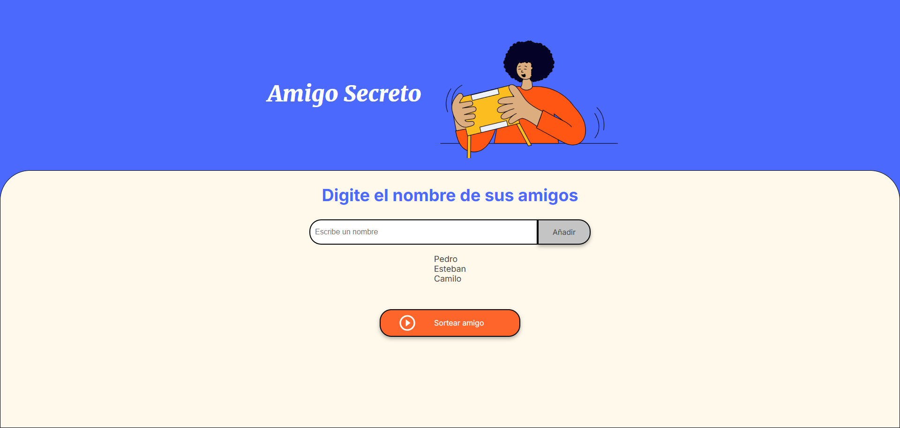
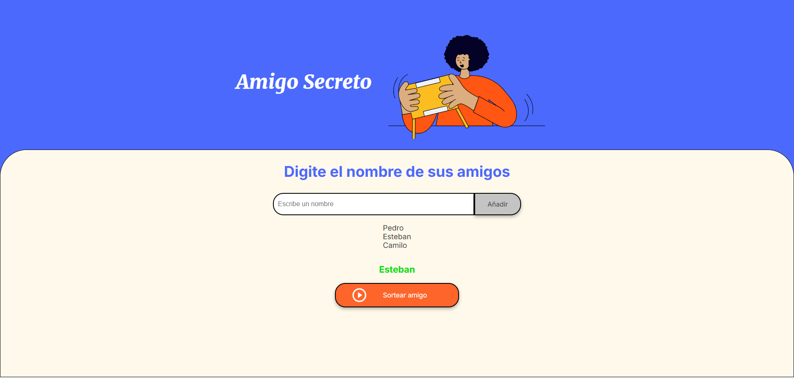

# Amigo Secreto

Amigo secreto es un divertido programa que elige entre una cantidad n de nombres (ingresados por el usuario) un solo nombre.

## 📌 Tabla de Contenidos

 - [Instalación](#instalación)
 - [Imágenes](#imágenes)
 - [Contribución](#contribución)
 - [Contacto](#contacto)
  
## ⚙️ Instalación

Sigue estos pasos para instalar y configurar el proyecto:

```
# Clona el repositorio
git clone https://github.com/flaviogastonok/Amigo-Secreto.git

# Entra en la carpeta del proyecto
cd nombre-del-proyecto
```

## 🖼️ Imágenes

Imagenes ilustrativas del proyecto.





## 🛠️ Contribución
Las contribuciones son bienvenidas
1. Haz un fork del repositorio
2. Crea una nueva rama para tu contribución:
   ```
    git checkout -b feature/nueva-funcionalidad
   ```
3. Realiza tus cambios y haz commit:
     ```
    git commit -m "Agrega nueva funcionalidad"
     ```
4. Sube tus cambios al repositorio remoto:
    ```
    git push origin feature/nueva-funcionalidad
    ```
5. Abre un Pull Request en GitHub.

## 📩 Contacto

Si tienes preguntas o sugerencias, puedes contactarme:

📧 Email: flaviogaston88@gmail.com
🐙 GitHub: flaviogastonok
